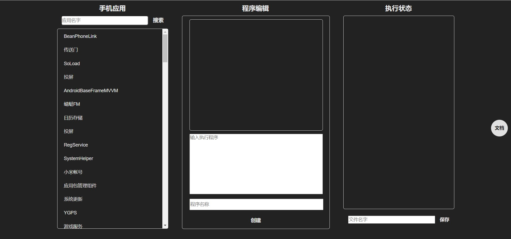

# AndroidAutomatic

AndroidAutomatic是一个可以在Android端实现自动化测试的一个辅助工具，无须冗余的复杂操作，加上可视化的脚本编写，让自动化回归简单，让小白也可以操作，目前处于1.0.0版，后续有时间会不断的优化操作。

## 快速开始

[操作指南，点击直达](https://blog.csdn.net/ming_147/article/details/125671332?spm=1001.2014.3001.5501)

## 欢迎关注作者

微信搜索【Android干货铺】，或扫描下面二维码关注，查阅更多技术文章！

<br/>

## 自动化测试效果图

<br/>

## License

```
Copyright (C) AbnerMing, AndroidAutomatic Open Source Project

Licensed under the Apache License, Version 2.0 (the "License");
you may not use this file except in compliance with the License.
You may obtain a copy of the License at

     http://www.apache.org/licenses/LICENSE-2.0

Unless required by applicable law or agreed to in writing, software
distributed under the License is distributed on an "AS IS" BASIS,
WITHOUT WARRANTIES OR CONDITIONS OF ANY KIND, either express or implied.
See the License for the specific language governing permissions and
limitations under the License.
```